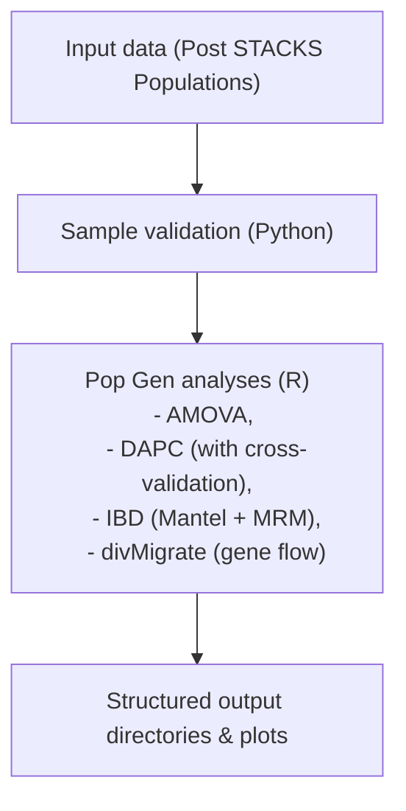

# Population Genomics Pipeline

## Project goals
In this project, we wrote a script that streamlines our most commonly used population genomics analyses into a clean
pipeline. We know how to run the analyses individually. However, our goal was to learn how to connect them together in a way 
that allows us to work faster using Python commands throughout to connect and guide the pipeline.

**Goals:**
1. Create a reproducible population genomics assembly and analysis
2. Use a Conda environment for transferable reproducibility
3. Collaborate using git to create the pipeline
4. Test the pipeline using ~3 population genomic datasets to confirm use between taxa/projects

### End Goal: Produce quality population genomic figures and analyses results reproducable for publication

## Analyses included in this pipeline (using multiple SNPs per locus datasets)
- AMOVA
- DAPC
- IBD
- divmigrate


## Overview
This pipeline uses Python as the master program handling orchestration of runs, validation, and file management. Every analysis
can be run individually as a function. The entire script is importable as a module.

All analyses are in the R programming language, where Python calls R for running the analyses and plotting the results.

## Workflow:



## Installation
1) Clone the repository: 
   ```bash
   git clone https://github.com/estrasko/Pop-Gen-Pipe.git
   ```
2) Move to directory: 
   ```bash
   cd Pop-Gen-Pipe
   ```

NOTE: you can also fork the repository and work that way.

### Create the Conda Environment
1) Put "environment.yml" in your designated working folder
2) Create conda environment under a new name: 
   ```bash
   conda env create -f environment.yml --name Pop-Gen-PipeEnv
   ```
3) Activate your new environment: 
   ```bash
   conda activate Pop-Gen-PipeEnv
   ```

## Required Input Files
Files are created by the *Populations* step in STACKS<sup>1 

*NOTE: ALL INPUT FILES MUST BE IN SAME ORDER (by population)!* Critically, FST and geo matrices must have identical dimensions
and identical population order.

### 1. Genepop files
| File           | Purpose           |
| -------------- | ----------------- |
| `haps.genepop` | AMOVA             |
| `snps.genepop` | DAPC + divMigrate |

### 2. Popmap (popmap.csv)
CSV file with: Sample,Population
LT-pop_01,Buxahatchee
LT-pop_02,Buxahatchee
...

The pattern is name of individual followed by population of origin (comma separated values)

### 3. FST matrix (fst.csv)
Square matrix:
0,0.24,0.23,0.18
0.24,0,0.19,0.13
0.23,0.19,0,0.13
0.18,0.13,0.13,0

### 4. Geographic distance matrix (geo.csv)
Square matrix:
0,170.41,138.18,80.14
170.41,0,77.68,90.25
138.18,77.68,0,57.79
80.14,90.25,57.79,0

## Run the Pipeline
```bash
python Pop_script_2.py \
  --haps-genepop populations.haps.genepop \
  --multi-snp-genepop populations.snps.genepop \
  --popmap popmap.csv \
  --fst-csv fst.csv \
  --geo-csv geo.csv \
  --outdir results \
  --scripts-dir . \
  --run-amova \
  --run-dapc \
  --run-ibd \
  --run-divmigrate
  ```

**any of the above analyses under *--scripts-dir* can be removed or run individually**

## Optional: Multithreading for divmigrate
This pipeline was created to run on personal laptops, clusters, or whatever you have to work with. The only occasional
computationally expensive program is divmigrate. If no threading option is specified, the default behavior is threads = 1.

**Users can utilize more CPU resources by optionally flagging --threads <N>**

Example: 
```bash
--run-divmigrate --threads 12
```

**NOTE: Threading is only available in divmigrate, not the other tests. The others don't need it**

## Analyses

### 1. Analysis of Molecular Variance (AMOVA)

### 2. Discriminant Analysis of Principal Components (DAPC)

### 3. Isolation by Distance (IBD)

### 4. Migration Analysis (divmigrate)
Estimates directional gene flow

Options:
--divmigrate-stat gst
--divmigrate-stat D
--divmigrate-stat Nm

Outputs:
- migration matrices
- network plots
- summary files

divmigrate is part of the diveRsity package. learn more about divmigrate from the developers: https://github.com/kkeenan02/diveRsity/tree/master


##References
1. Rochette, N. C., A. G. Rivera‐Colón, and J. M. Catchen. 2019. Stacks 2: Analytical methods for paired‐end sequencing improve RADseq‐based population genomics. Molecular Ecology 28(21):4737–4754.


# Feedback

You have a good start here.
I would recommend adding PCA to your list of analyses; this can be done using
all SNPs or one SNP per locus.
Creating the whole pipeline, from raw reads to results with figures might be a
bit ambitious for your class project.
I recommend you start by focusing on one part of the overall pipeline first.
For example, you could focus on starting with the assembly (or assemblies)
output by STACKS or other assemblers, and automating several of the analyses.

If you use Python, you will likely want to use the subprocess module for
running other tools outside of Python.
[Here is an intro to Python's subprocess module](https://www.geeksforgeeks.org/python/python-subprocess-module/).

You can use other languages for the project too (Python is not required).
