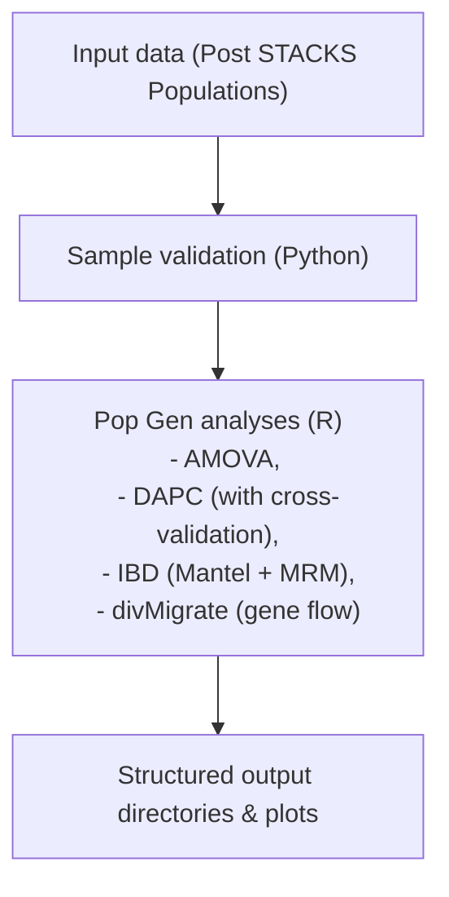

# Population Genomics Pipeline

## Project goals

In this project, we built a Python pipeline that connects commonly used population genomics analyses — AMOVA, DAPC, IBD, and divMigrate (using multiple SNPs per locus datasets) — into a single, streamlined script that can be imported as a module. While we already knew how to run the analyses individually, our goal was to learn how to string them together using Python, enabling faster and more reproducible results.

### Objectives
1. Create a reproducible population genomics analysis workflow
2. Use a Conda environment for transferable reproducibility
3. Collaborate using git to create the pipeline
4. Test the pipeline using ~3 population genomic datasets to confirm use across taxa/projects<br/>


#### End Goal: Produce quality population genomic figures and analyses results reproducable for publication.<br/><br/>

## Overview

Python is the master program for this pipeline handling file management, validaiton, and orchestration of runs, including calling R for running the analyses and plotting the results. All analyses within the pipeline are in the R programming language and can be run individually as functions. The pipeline script is importable as a Python module.<br/><br/>

## Workflow


<br/>

## Installation  

1. Clone the repository: 
   ```bash
   git clone https://github.com/estrasko/Pop-Gen-Pipe.git
   ```
   > Note: You can also fork the repository and work that way.

2. Move to the directory: 
   ```bash
   cd Pop-Gen-Pipe
   ```

3. Create and activate the conda environment:

   1. Put "environment.yml" in your designated working folder.

   1. Create a new conda environment: 
      ```bash
      conda env create -f environment.yml
      ```
   1. Activate your new environment: 
      ```bash
      conda activate Pop-Gen-PipeEnv
      ```
<br/>

## Required Input Files  

Files required for input in this pipeline are created by the *Populations* step in STACKS<sup>1</sup>.

> [!IMPORTANT]
> **All input files must have populations in the same order!** Critically, FST and geo matrices must have identical dimensions and identical population order.

### 1. Genepop files

   | File           | Purpose               |
   | -------------- | --------------------- |
   | `haps.genepop` | AMOVA                 |
   | `snps.genepop` | DAPC, divMigrate, IBD |

### 2. Popmap (popmap.csv)

&emsp;CSV file with two columns:

   ```csv
   Sample,Population
   LT-pop_01,Buxahatchee
   LT-pop_02,Buxahatchee
   ...
   ```
&emsp;*Sample* is the name of the individual and *Population* is the population of origin.<br/>

### 3. FST (Fixation index) matrix (fst.csv)

&emsp;CSV file with a square matrix:

   ```csv
   0,0.24,0.23,0.18
   0.24,0,0.19,0.13
   0.23,0.19,0,0.13
   0.18,0.13,0.13,0
   ```

### 4. Geographic distance matrix (geo.csv)

&emsp;CSV file with a square matrix:

   ```csv
   0,170.41,138.18,80.14
   170.41,0,77.68,90.25
   138.18,77.68,0,57.79
   80.14,90.25,57.79,0
   ```
   <br/>

### 5. Custom population colors (pop_colors.csv) *optional*

&emsp;CSV file with two columns:

   ```csv
   Population,Color
   Buxahatchee,cornflowerblue
   Ohatchee,lightsteelblue2
   Choccolocco,indianred2
   Coosa,lightgoldenrod3
   ```
&emsp;*Population* is the name of the origin and *Color* is an R-friendly color, whether that be the R name (e.g., cornflowerblue) or the color code (e.g., #6495ED).<br/>
In DAPC, this color codes each populations with its own unique color. In divmigrate, the first color from you color file will be used to create the directional migration arrows. IBD and AMOVA are not affected by color.

## Analyses

### 1. Analysis of Molecular Variance (AMOVA)

&emsp;Partitions variation within samples (individuals), between individuals within the population, and between populations  

&emsp;Outputs:    
&emsp;- summary statistics file  


&emsp;- permutation test plot 


### 2. Discriminant Analysis of Principal Components (DAPC)

&emsp;Creates clusters of individuals sharing similar genetic data. Data is transformed using a Principal Component Analysis (PCA) and subsequently clustered using discriminant analysis (DA). This is a multivariate method requiring no a-priori knowledge.
[Learn more about DAPC.](https://grunwaldlab.github.io/Population_Genetics_in_R/DAPC.html#:~:text=Discriminant%20analysis%20of%20principal%20components%20(DAPC))  

&emsp;Outputs:  
&emsp;- summary files

&emsp;- assignment plot  


&emsp;- scatter plot 


### 3. Isolation by Distance (IBD)

&emsp;Tests for distance-limited gene flow

&emsp;Outputs:  
&emsp;- summary files  
&emsp;- FST vs. distance plot 


### 4. Migration Analysis (divmigrate)

&emsp;Estimates directional gene flow

&emsp;Options:  
&emsp;`--divmigrate-stat gst`  
&emsp;`--divmigrate-stat D`  
&emsp;`--divmigrate-stat Nm`  

&emsp;Outputs:  
&emsp;- summary files  
&emsp;- migration matrices  
&emsp;- network plots  


&emsp;divmigrate is part of the diveRsity package. [Learn more about divmigrate from the developers.](https://github.com/kkeenan02/diveRsity/tree/master)
<br/><br/>

## Run the Pipeline

```bash
python Pop_script_2.py \
  --haps-genepop populations.haps.genepop \
  --multi-snp-genepop populations.snps.genepop \
  --popmap popmap.csv \
  --fst-csv fst.csv \
  --geo-csv geo.csv \
  --outdir results \
  --scripts-dir . \
  --run-amova \
  --run-dapc \
  --run-ibd \
  --run-divmigrate
  ```

**Any of the above analyses after** `--scripts-dir` **can be removed or run individually.** If each file is located in your current working directory, then only the file name is needed as the function argument. If files are located in a directory other than your current working directory, a file path (e.g., snail_input_files/popmap.csv) is needed as the argument. A file path can also be provided in `--outdir` to store the output files in a directory other than your current working directory.<br/><br/>

## Optional: Multithreading for divmigrate

This pipeline was created to run on personal laptops, clusters, or whatever you have to work with. The only occasional
computationally expensive program is divmigrate. If no threading option is specified, the default is threads = 1. **Users can utilize more CPU resources by optionally flagging** `--threads`.

For example: 
```bash
--run-divmigrate --threads 12
```
<br/>

## References

1. Rochette, N. C., A. G. Rivera‐Colón, and J. M. Catchen. 2019. Stacks 2: Analytical methods for paired‐end sequencing improve RADseq‐based population genomics. Molecular Ecology 28(21):4737–4754.<br/><br/>
2. Thia, J.A. (2023). Guidelines for standardizing the application of discriminant analysis of principal components to genotype data. Molecular Ecology Resources, 23(3), 523–538. https://doi.org/10.1111/1755-0998.13706

# Feedback

You have a good start here.
I would recommend adding PCA to your list of analyses; this can be done using
all SNPs or one SNP per locus.
Creating the whole pipeline, from raw reads to results with figures might be a
bit ambitious for your class project.
I recommend you start by focusing on one part of the overall pipeline first.
For example, you could focus on starting with the assembly (or assemblies)
output by STACKS or other assemblers, and automating several of the analyses.

If you use Python, you will likely want to use the subprocess module for
running other tools outside of Python.
[Here is an intro to Python's subprocess module](https://www.geeksforgeeks.org/python/python-subprocess-module/).

You can use other languages for the project too (Python is not required).
